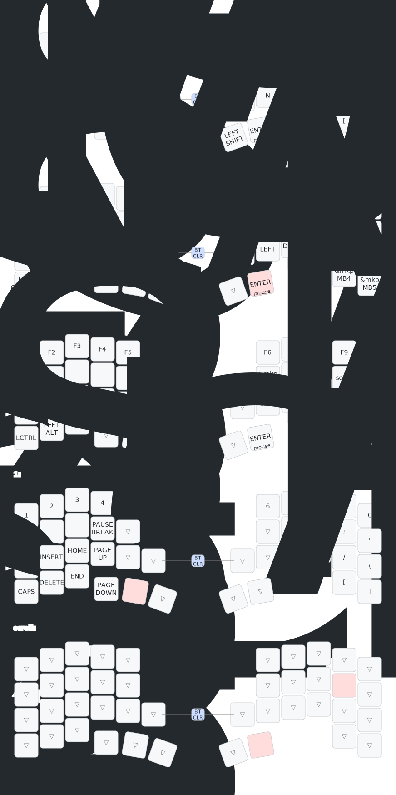

[torabo-tsuki LP](https://github.com/sekigon-gonnoc/torabo-tsuki-lp)用のZMKファームウェア

* _centralがついているuf2をトラックボールがついている方に、_peripheralを反対側に書き込んでください
* キーマップはkeymap-editorおよびzmk-studioで編集できます

## キーマップ



---

## フォーク元からの変更点

このリポジトリは[オリジナルのtorabo-tsuki LPファームウェア](https://github.com/sekigon-gonnoc/torabo-tsuki-lp)をフォークし、以下の機能・レイアウト変更を行っています。

### 機能面の変更

#### トラックボール機能の拡張

| 機能 | 説明 |
|------|------|
| **一時レイヤー自動有効化** | トラックボール操作時に一時レイヤー（レイヤー2）を自動的に有効化（650ms持続） |
| **スクロールモード** | レイヤー4有効時にトラックボールがスクロールモードに切り替わる |
| **スクロール速度調整** | Y軸1:4スケーリングで滑らかなスクロール操作を実現 |

**変更前（オリジナル）:**
```
&trackball_listener {
    input-processors = <&zip_xy_transform (INPUT_TRANSFORM_X_INVERT | INPUT_TRANSFORM_Y_INVERT)>;
};
```

**変更後:**
```
&trackball_listener {
    // デフォルト: マウス移動モード + 一時レイヤー有効化
    input-processors = <
        &zip_xy_transform (INPUT_TRANSFORM_X_INVERT | INPUT_TRANSFORM_Y_INVERT)
        &zip_temp_layer 2 650
    >;

    // レイヤー4有効時: スクロールモード
    scroller {
        layers = <4>;
        input-processors = <
            &zip_xy_transform INPUT_TRANSFORM_X_INVERT
            &zip_xy_scaler 1 4
            &zip_xy_to_scroll_mapper
        >;
    };
};
```

### レイアウト面の変更

| 項目 | オリジナル | 変更後 |
|------|-----------|--------|
| **キー数** | 61キー | 42キー（Sサイズ） |
| **行数** | 5行 | 4行 |

keymap-editor用のレイアウト定義（`config/info.json`）も42キーのコンパクトレイアウトに対応するよう更新しました。